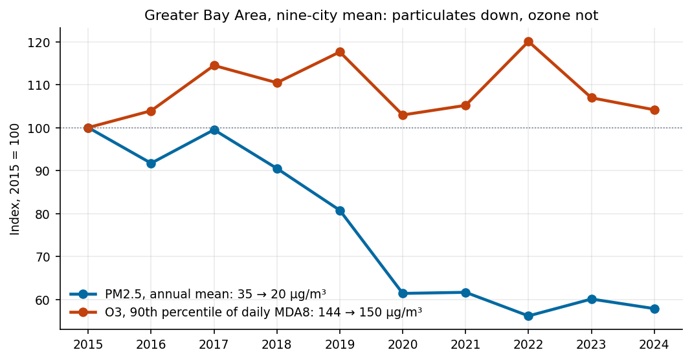
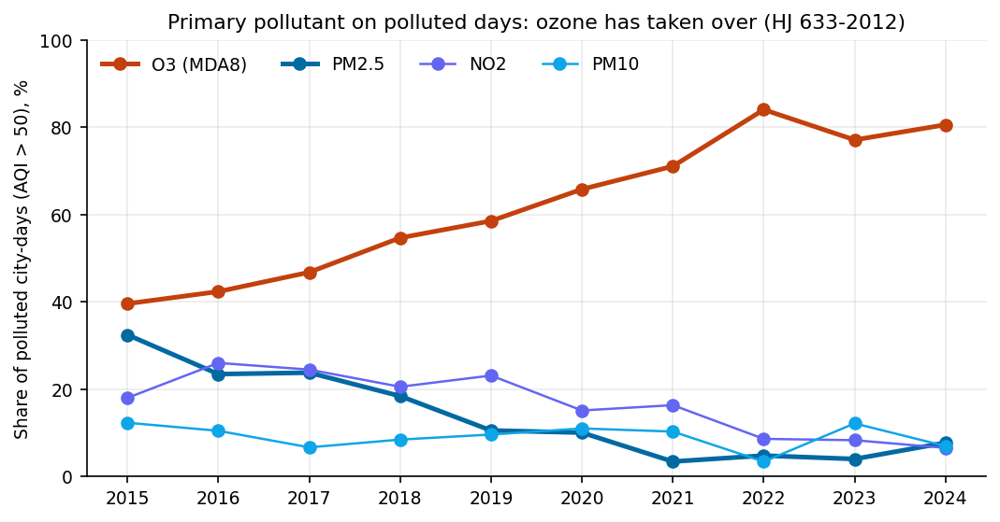
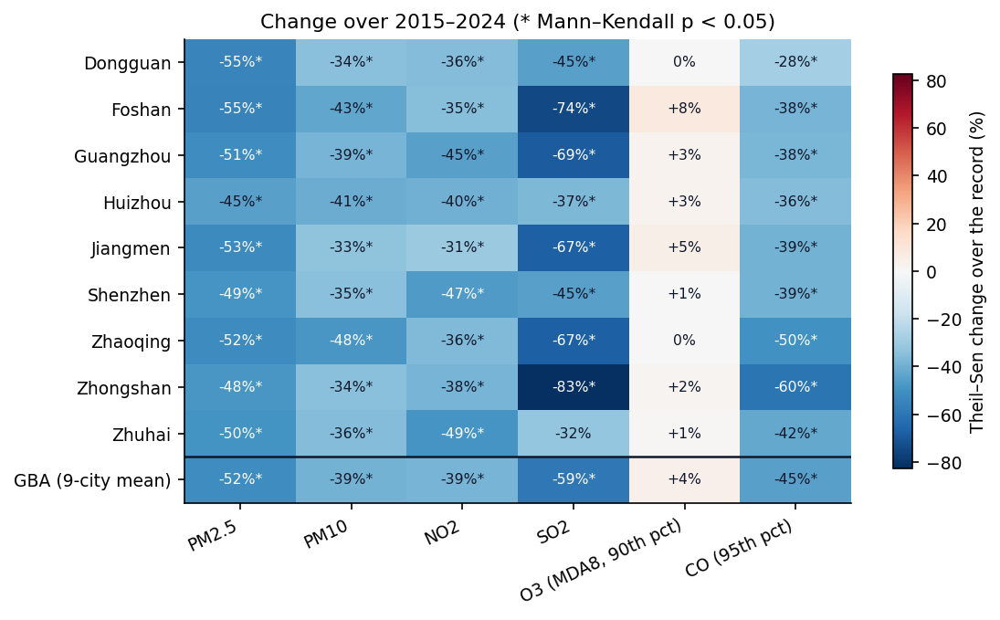
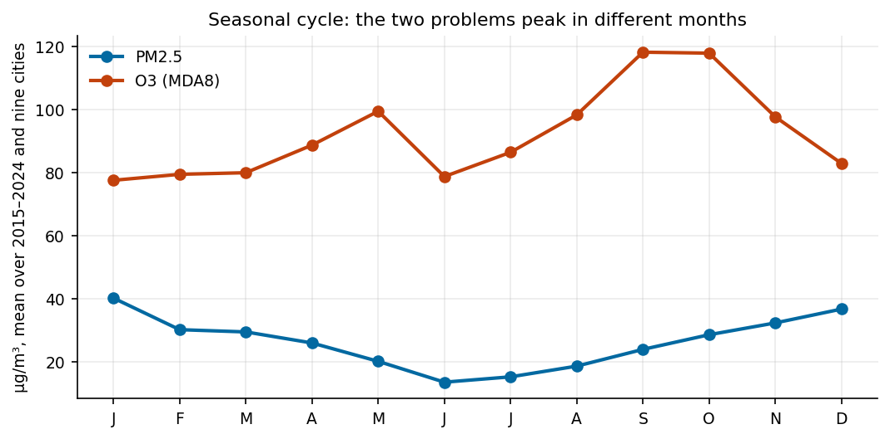
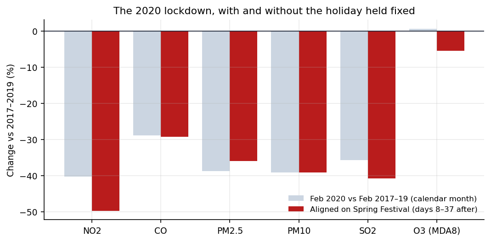

# Greater Bay Area air quality, 2015–2024

Nine cities, ten years, every hour of the China National Environmental
Monitoring Centre's city data — assessed by the rules of China's own air quality
standard, and checked against the figures the cities publish.

**Particulate pollution halved. Ozone did not move.**



## What the record shows

**PM2.5 fell by half, in every city.** The nine-city mean went from 34.8 µg/m³ in
2015 to 20.1 in 2024: a Theil–Sen trend of −1.91 µg/m³ a year, −52% over the
record (Mann–Kendall p = 0.0004). Every one of the nine cities fell by between
45% and 55%, and every one of those trends is significant. NO2 fell 39% and SO2
59% region-wide, with every city's NO2 trend significant.

**Ozone did not.** The 90th percentile of daily maximum 8-hour ozone — the
statistic the standard assesses — was 144 µg/m³ in 2015 and 150 in 2024, a change
of +4% with no significant trend (p = 0.48) in the region or in any single city.
It moves with the weather rather than with the other pollutants: the regional
value crossed the 160 µg/m³ limit in 2017, 2019 and 2022, peaking at 173 in 2022,
and fell back each time. **In 2024 ozone is the only pollutant still over the
national limit anywhere in the region**, in Dongguan (102% of the limit) and
Jiangmen (105%). Every city is inside the limit for everything else — PM2.5 at
49–64% of it, NO2 at 36–72%.

**Ozone now sets the air quality index on four polluted days in five.** Scoring
every city-day by HJ 633-2012 — each pollutant's sub-index from the standard's
table, the AQI as the largest — ozone was the primary pollutant on **40%** of
polluted days (AQI above 50) in 2015 and **81%** in 2024, peaking at 84% in 2022.
PM2.5 went the other way, from 32% to 8%. Whichever ozone statistic is taken, the
change is upward and not statistically significant: the 90th percentile of MDA8
+4% (p = 0.48), its annual mean +9% (p = 0.11). Ozone has not got much worse; it
has become the problem because everything else got better.





**The two problems peak in different seasons.** PM2.5 is a winter problem —
highest in January (40 µg/m³), lowest in June (14). Ozone peaks in **September and
October** (118), not in midsummer, and dips in June. That pattern is consistent
with the summer monsoon bringing clean marine air, cloud and rain, and the dry,
sunny autumn bringing the opposite. Controlling one pollutant does not help with
the other on the same calendar.



**The 2020 lockdown cut NO2 by half — once the Spring Festival is accounted
for.** Compared month for month, February 2020 had 40% less NO2 than the
Februaries of 2017–2019. But the festival moves by up to three weeks and empties
Guangdong's factories every year, so earlier Februaries already contain part of a
holiday dip. Aligning each year on the festival instead — days 8 to 37 after
正月初一, so that every window is the post-holiday return to work and only 2020's
is also the lockdown — puts the NO2 drop at **50%**. PM2.5 fell by 36%. Ozone
moved by −5%: a halving of NO2 did not bring ozone down, the same thing the decade
shows.



**Shenzhen is usually, not always, the cleanest city for PM2.5.** It had the
lowest annual mean in seven of the ten years; Huizhou did in 2015 and Zhuhai in
2016 and 2020.

The full analysis, with every table behind these statements, is in
[`notebooks/analysis.ipynb`](notebooks/analysis.ipynb). Its closing summary is
generated from the tables rather than written by hand.

## Checked against the published figures

Before any finding, a check that the pipeline reproduces what the cities
themselves report:

| City, year | This pipeline | Published | Source |
|---|---|---|---|
| Guangzhou, 2015 | 39.4 µg/m³ | 39 | 广州市环境空气质量达标规划（2016–2025年） |
| Guangzhou, 2015 | 39.4 µg/m³ | 38.8 | Greenpeace, independent recomputation from the same CNEMC feed |
| Shenzhen, 2024 | 17.2 µg/m³ | 17 | 深圳市生态环境局，2024年12月环境空气质量状况通报 |

Both ends of the record agree to within half a microgram.

## How the numbers are made

- **Every day, not a sample.** 3,653 calendar days, 3,646 of them in the archive.
  Monthly means from a one-in-three sample of days carry an error that nothing in
  the result reveals.
- **The standard's own validity rules** (GB 3095-2012). A daily mean needs 20
  hourly values; a monthly mean 27 valid days (25 in February); an annual value
  324. Values short of the rule are missing, not estimated. About 97% of city-days
  are valid.
- **Ozone assessed the way the standard assesses it** (HJ 663-2013): the daily
  maximum of the 8-hour running mean, requiring 14 valid 8-hour means in the
  08:00–24:00 window, then the 90th percentile over the year. An annual mean
  would dilute exactly the episodes the standard exists to catch. CO likewise is
  assessed on the 95th percentile of daily means.
- **A regional value only when all nine cities are valid.** A mean over whichever
  cities happen to have data moves with the membership, and that movement looks
  like a trend. PM10 has no regional value for 2018 for this reason: Dongguan,
  Zhaoqing and Zhongshan each fell short of 324 valid days.
- **Trends are Theil–Sen with a Mann–Kendall test.** Ten annual values are too
  few to trust least squares with one unusual year in them; Theil–Sen is the
  median of pairwise slopes, and Mann–Kendall tests the ranks without assuming a
  shape for the change.
- **The daily AQI follows HJ 633-2012**: sub-indices from the standard's
  daily breakpoints, rounded up as it requires, computed only on city-days where
  all six pollutants are valid, so a data gap cannot quietly stop a pollutant
  from being primary.
- **The lockdown is measured with the holiday held fixed**, as above. A test in
  `tests/` shows that with no lockdown effect at all, a calendar-month comparison
  still reports a change of more than 5% purely from where the festival fell.

## What it does not show

- **Observed concentrations, not emissions.** Year-to-year weather drives part of
  every change here, and ozone most of all. No meteorological normalisation is
  applied, so a trend is what the air did, not what policy did.
- **City averages over a changing network.** CNEMC's city values average the
  national-controlled monitoring sites in each city, and sites have been added and
  moved over the decade. That affects comparability in ways this analysis cannot
  separate.
- **The lockdown comparison holds the holiday fixed, not the weather** of early
  2020.
- **Source-side gaps are left as gaps.** Seven days are absent from the archive,
  five of them 22–26 December 2018; they are listed in
  [`data/missing_days.txt`](data/missing_days.txt).
- **The ozone window ends at 23:00** (16 eight-hour means) because the source's
  hours run 0–23; the standard's window runs to 24:00. The 14-value requirement is
  kept.

## Running it

```bash
pip install -r requirements.txt

make test       # 34 tests on the validity rules, the AQI and the statistics
make notebook   # rerun the analysis from the committed tables, regenerate every figure
make download   # optional: fetch every day 2015–2024 again (about two hours, resumable)
make data       # optional: rebuild the tables from the downloaded days
```

The daily, monthly and annual tables are committed under `data/`, so the analysis
reproduces without downloading anything.

## Data

Hourly city-level concentrations of PM2.5, PM10, SO2, NO2, CO and O3 from the
**China National Environmental Monitoring Centre** (中国环境监测总站) national
real-time air quality publishing platform, as archived day by day at
[quotsoft.net/air](https://quotsoft.net/air/) by Wang Xiaolei, who publishes it
for analysis and research. The committed tables are aggregates derived from that
record for these nine cities, provided for non-commercial research use.

| File | Contents |
|---|---|
| `data/gba_daily_2015_2024.csv` | one row per city and day; empty where the day fails its rule |
| `data/gba_monthly_2015_2024.csv` | monthly means, by the monthly rule |
| `data/gba_annual_2015_2024.csv` | annual assessment values, including the O3 and CO percentiles |
| `data/completeness.csv` | share of days valid, per city and pollutant |
| `data/missing_days.txt` | days absent from the archive |

Units are µg/m³ throughout, except CO in mg/m³.

## Layout

```
gba/
  metrics.py         validity rules, daily MDA8, annual assessment statistics, trends
  aqi.py             daily AQI and primary pollutant by HJ 633-2012
  analysis.py        one function per question this README answers
  figures.py         the seven figures
scripts/
  download_cnemc.py  every day from the archive, nine cities kept, cached
  build_dataset.py   hourly archive -> daily, monthly and annual tables
notebooks/
  analysis.ipynb     the analysis, executed, with every table and figure
tests/               34 tests, each rule tested at its boundary
outputs/             figures
```

## Changelog

**1.0 (2026-09)** — rebuilt entirely on the CNEMC monitoring record. An earlier
draft of this repository used simulated data to prototype the analysis and
presented it as monitoring data; none of it remains, and every figure and number
above comes from the record.

## Related repositories

- [aiwp-china-verification](https://github.com/Zhaohh0706/aiwp-china-verification) — fixed-lead verification of physics and AI weather models at Chinese stations
- [pv-wind-power-forecast](https://github.com/Zhaohh0706/pv-wind-power-forecast) — PV and wind forecasting, priced against Chinese grid-code assessment
- [cn-weather-cube](https://github.com/Zhaohh0706/cn-weather-cube) — point weather with units attached and sources named

## Licence

Code: MIT. Data: see above.
